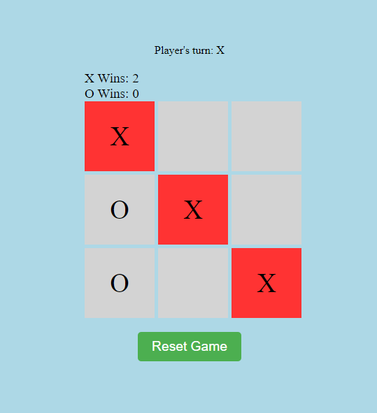

# Tic-Tac-Toe-WebComponent



## Overview

Tic-Tac-Toe is a classic two-player game where players take turns marking spaces in a 3x3 grid with their respective symbols (usually X and O). The objective is to be the first player to form a horizontal, vertical, or diagonal line of their symbols.

This documentation provides an overview of the implementation of a Tic-Tac-Toe game using HTML, CSS, and JavaScript.

## Features

- **Game Board:** A 3x3 grid where players can mark their symbols (X or O).
- **Player Turn Display:** Indicates whose turn it is (X or O).
- **Scoreboard:** Keeps track of the wins for both X and O players.
- **Win Detection:** Detects when a player wins by forming a line of their symbols.
- **Reset Button:** Allows players to reset the game and start over.

## Implementation Details

- **HTML Structure:** The game interface is structured using HTML and consists of elements such as the game board, player turn display, scoreboard, and reset button.
- **CSS Styling:** CSS is used to style the game interface, providing a visually appealing design. It includes styling for the board layout, cell appearance, hover effects, and animations for winning cells.
- **JavaScript Functionality:** JavaScript handles the game logic and interactivity. Key functionalities include managing player turns, detecting wins, updating the scoreboard, handling cell clicks, and resetting the game.

## Usage

To play the Tic-Tac-Toe game:

1. Open your main HTML page of your project and add the provided JavaScript file:
    ```html
    <script src="./tic-tac-toe.js"></script>
    ```

2. Add the Tic-Tac-Toe component to your HTML code:
    ```html
    <tic-tac-toe></tic-tac-toe>
    ```

3. Players can take turns clicking on empty cells to mark their symbols (X or O).
4. The game automatically detects wins and updates the scoreboard.
5. Use the reset button to start a new game at any time.

## Example

Here is an example of how to integrate the Tic-Tac-Toe WebComponent into your HTML file:

```html
<!DOCTYPE html>
<html lang="en">
<head>
    <meta charset="UTF-8">
    <meta name="viewport" content="width=device-width, initial-scale=1.0">
    <title>Tic-Tac-Toe Game</title>
    <link rel="stylesheet" href="./style.css">
</head>
<body>
    <h1>Tic-Tac-Toe Game</h1>
    <tic-tac-toe></tic-tac-toe>
    <script src="./tic-tac-toe.js"></script>
</body>
</html>